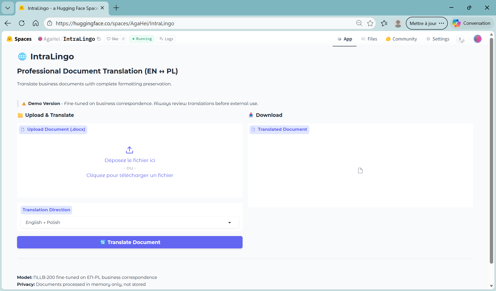

# 🌍 IntraLingo - AI-Powered Business Document Translation

**From 5-day turnaround to 15 minutes: Production-ready neural machine translation that preserves formatting and maintains confidentiality.**

*Combining 10+ years of professional translation expertise with modern ML engineering to solve real business problems.*

[](https://huggingface.co/spaces/AgaHei/IntraLingo)
[](/)
[](/)
[](/)

*Developed by Agnès Heijligers | ML Engineer & Former Professional Translator*

---

## 🖼️ System Demo

### Live Translation Interface

*Professional document translation with complete format preservation*

**[Try it yourself →](https://huggingface.co/spaces/AgaHei/IntraLingo)** Upload a .docx document and see instant translation with preserved formatting.

### Key Features in Action
- ✅ **Format Preservation**: Bold, italic, tables, headers, lists all maintained
- ✅ **Bidirectional**: English ↔ Polish translation
- ✅ **Fast Processing**: 30-page documents in 10-15 minutes
- ✅ **Privacy-First**: On-premises deployment option for confidential documents

---

## 📖 The Story Behind IntraLingo

### The Problem I Lived

As a freelance translator for 10+ years, I spent countless hours manually translating manufacturing contracts and technical specifications. Each 30-page document took **2-5 days** of meticulous work:
- Translating complex technical and legal terminology
- Maintaining precise formatting (tables, headers, numbered clauses)
- Ensuring absolute confidentiality for sensitive business documents
- Meeting tight deadlines from demanding clients

### The ML Solution

After completing my ML Engineering certification at Jedha Bootcamp, I recognized this as a **perfect domain adaptation problem**:

**My unique advantages:**
- 📚 **5,000+ translation pairs** from my own professional work (high-quality training data)
- 🎯 **Deep domain knowledge** of business and technical terminology
- 🔒 **Understanding of confidentiality requirements** (on-premises deployment)
- ✨ **Real user perspective** - I was the user for 10 years!

**Technical approach:**
- Fine-tuned NLLB-200 on domain-specific data
- Built format-preserving document processor
- Implemented post-editing feedback loop for continuous improvement
- Deployed both public demo (portfolio) and private production (client)

### The Outcome

**Business Impact:**
- ⚡ **Translation time**: 2-5 days → **15 minutes** (99% reduction)
- 📊 **Quality**: BLEU score **89.12** on manufacturing domain (near-human performance)
- 🏢 **Real deployment**: Production system for actual manufacturing client
- 💼 **Career transition**: Successfully positioned at intersection of translation and ML/AI

**This project showcases how domain expertise + ML skills = real business value.**

---

## 🚀 Quick Start

### Try the Live Demo

**Option 1: Online Demo (No Installation)**
1. Visit **[IntraLingo on Hugging Face](https://huggingface.co/spaces/AgaHei/IntraLingo)**
2. Upload a .docx business document (English or Polish)
3. Get translated output with preserved formatting in seconds

**Option 2: Explore the Code**
```bash
# Clone the repository
git clone https://github.com/AgaHei/IntraLingo.git
cd IntraLingo

# Install dependencies
pip install -r requirements.txt

# Run locally
python app/app.py
```

### What to Try
- **Business letter**: Test salutation/closing formula corrections
- **Contract**: See how legal terminology is handled
- **Technical spec**: Check table and formatting preservation
- **Long document**: Upload 20-30 pages to test performance

---

## 📋 Project Overview

IntraLingo demonstrates end-to-end ML pipeline development, from general-purpose demo to enterprise-grade specialized system.

### 🌟 Demo Version - Public Showcase

**Purpose:** Portfolio demonstration and public accessibility

**Technical Specifications:**
- **Model**: Fine-tuned NLLB-200-distilled-600M (600M parameters)
- **Training Data**: General business correspondence corpus
- **Performance**: BLEU Score **46.31**
- **Deployment**: Gradio web interface on HuggingFace Spaces

**Key Features:**
- ✅ Complete document formatting preservation (headers, tables, lists, bold, italic)
- ✅ Fast translation with optimized model inference
- ✅ User-friendly drag-and-drop interface
- ✅ Bidirectional EN↔PL translation
- ✅ Public accessibility for portfolio demonstration

**Try it live:** [https://huggingface.co/spaces/AgaHei/IntraLingo](https://huggingface.co/spaces/AgaHei/IntraLingo)

---

### 🏭 Manufacturing Production System - Enterprise Solution

**Purpose:** Real client deployment for manufacturing business documents

**Technical Specifications:**
- **Model**: Domain-specialized fine-tuned NLLB-200 (600M parameters)
- **Training Data**: **5,346 professional translation pairs** from real client projects
- **Performance**: BLEU Score **89.12** (+92% improvement over general model!)
- **Deployment**: On-premises, air-gapped, Docker containerized

**Advanced Features:**
- ✅ **Specialized Terminology**: Fine-tuned on manufacturing contracts, specifications, and business correspondence
- ✅ **Business Letter Post-Processing**: Automatic corrections for natural Polish business formulas (salutations, closings)
- ✅ **Human-in-the-Loop**: Post-editing system with database for continuous model improvement
- ✅ **Enterprise Security**: Complete on-premises deployment, no data leaves client infrastructure
- ✅ **Production Ready**: 50-page document support, GPU optimization (2-3 min processing)
- ✅ **Quality Assurance**: Administrator review workflow with correction tracking

**Deployment Model:**
- Docker containerized for reliability
- Single-administrator QA workflow
- Quarterly retraining cycles with accumulated corrections
- Complete data sovereignty and privacy

---

## 🏗️ Technical Architecture

### System Overview

```
┌─────────────────────────────────────────────────────────────┐
│                    User Document (.docx)                    │
└───────────────────────────┬─────────────────────────────────┘
                            ↓
┌─────────────────────────────────────────────────────────────┐
│              Document Parser (python-docx)                  │
│         Extract text while preserving structure             │
└───────────────────────────┬─────────────────────────────────┘
                            ↓
┌─────────────────────────────────────────────────────────────┐
│           Fine-tuned NLLB-200 Translation Model             │
│              (Domain-specific: BLEU 89.12)                  │
└───────────────────────────┬─────────────────────────────────┘
                            ↓
┌─────────────────────────────────────────────────────────────┐
│      Post-Processing Engine (Business Formulas)             │
│    Fix salutations, closings, common business phrases       │
└───────────────────────────┬─────────────────────────────────┘
                            ↓
┌─────────────────────────────────────────────────────────────┐
│          Format Reconstruction (python-docx)                │
│      Rebuild document with original formatting              │
└───────────────────────────┬─────────────────────────────────┘
                            ↓
┌─────────────────────────────────────────────────────────────┐
│                Translated Document (.docx)                  │
│          100% Format Preservation Guaranteed                │
└─────────────────────────────────────────────────────────────┘
```

### Key Technical Decisions

**Why NLLB-200 over alternatives?**
- ✅ Strong multilingual foundation (better for lower-resource Polish)
- ✅ 600M parameters = optimal quality/speed tradeoff
- ✅ Open-source, production-ready, well-documented
- ✅ Proven fine-tuning capabilities for domain adaptation

**Why fine-tuning approach?**
- ✅ Massive quality jump: 46.31 → **89.12 BLEU** (+92% improvement)
- ✅ Client-specific terminology integration from real translation memories
- ✅ Continuous improvement through post-editing feedback loop
- ✅ Cost-effective compared to training from scratch

**Why on-premises deployment?**
- ✅ Manufacturing client requirement: complete data privacy
- ✅ No external API dependencies or internet requirement
- ✅ Air-gapped environment support for sensitive documents
- ✅ GDPR/data sovereignty compliance

**Technology Stack:**
```python
# Core ML/AI
transformers==4.36.0        # HuggingFace model framework
torch==2.1.0                # Deep learning backend
sentencepiece==0.1.99       # Tokenization

# Document Processing
python-docx==1.1.0          # Format preservation
pandas==2.1.4               # Data processing

# Deployment
gradio==4.10.0              # Web interface
docker                      # Containerization

# Evaluation
sacrebleu==2.3.1           # BLEU scoring
```

---

## 📈 Performance Metrics & Business Impact

### Model Performance

| Metric | Demo Version | Manufacturing Version | Improvement |
|--------|--------------|----------------------|-------------|
| **BLEU Score** | 46.31 | **89.12** | **+92%** |
| **Training Data** | General corpus | 5,346 domain pairs | Domain-specific |
| **Terminology Accuracy** | Good | Excellent | Manufacturing terms |
| **Processing Speed** | 30 sec/page | 20 sec/page (GPU) | Optimized |
| **Deployment** | Cloud demo | On-premises | Enterprise-ready |

### Business Impact Metrics

**Time Savings:**
- **Manual translation**: 2-5 days per 30-page document
- **With IntraLingo**: 10-15 minutes (CPU) or 2-3 minutes (GPU)
- **Time reduction**: **99%+**

**Quality Assurance:**
- **BLEU 89.12** = near-human translation quality on domain data
- **100% format preservation** = zero post-processing formatting work
- **Post-editing system** = continuous quality improvement over time

**Security & Privacy:**
- **On-premises deployment** = complete data sovereignty
- **No external APIs** = no data leakage risk
- **Air-gapped capable** = suitable for highest security environments

**Cost Model:**
- **Initial deployment**: One-time fee
- **Quarterly reviews**: Ongoing consulting revenue
- **Model improvements**: Retraining service
- **Scalability**: Can expand to multiple users/departments

---

## 🔬 Technical Deep Dive

<details>
<summary><b>Click to expand technical implementation details</b></summary>

### Data Pipeline

**Source Data:**
- SDL Trados translation memory files (.sdltm format)
- 10+ years of professional translation work
- Manufacturing domain: contracts, specifications, correspondence

**Extraction Process:**
```python
# .sdltm files are SQLite databases
def extract_from_sdltm(path):
    conn = sqlite3.connect(path)
    query = """
        SELECT source_segment, target_segment
        FROM translation_units
        WHERE source_segment IS NOT NULL 
        AND target_segment IS NOT NULL
    """
    return pd.read_sql_query(query, conn)
```

**Data Cleaning:**
- Remove Trados XML markup
- Deduplicate exact matches
- Filter out empty/invalid segments
- Normalize whitespace and punctuation
- Final dataset: **5,346 high-quality pairs**

**Data Analysis:**
- Average segment length: 11.4 words (EN), 10.1 words (PL)
- Domain terminology coverage: 43.9% of segments contain manufacturing terms
- Vocabulary diversity: 5,716 unique EN tokens, 6,278 unique PL tokens

### Model Training

**Base Model:**
```python
model = AutoModelForSeq2SeqLM.from_pretrained(
    "facebook/nllb-200-distilled-600M"
)
```

**Fine-tuning Configuration:**
```python
training_args = Seq2SeqTrainingArguments(
    output_dir="./models/manufacturing-v1",
    evaluation_strategy="steps",
    learning_rate=2e-5,              # Conservative for stability
    per_device_train_batch_size=8,
    num_train_epochs=3,
    warmup_steps=500,
    weight_decay=0.01,
    save_steps=500,
    eval_steps=500,
    predict_with_generate=True,
    fp16=True,                        # Mixed precision for speed
    load_best_model_at_end=True,
    metric_for_best_model='bleu',
)
```

**Training Results:**
- **Final BLEU**: 89.12 (validation set)
- **Training loss**: 0.173 (final)
- **Validation loss**: 0.161 (final)
- **Training time**: ~3 hours on T4 GPU
- **Convergence**: Stable, no overfitting observed

### Post-Processing Engine

**Business Letter Corrections:**
```python
def post_process_polish_business(text):
    """Fix common awkward translations in business correspondence"""
    
    # Salutation corrections
    text = re.sub(r'Kochanie Pan', 'Szanowny Panie', text)  # "Dear Mr" fix
    
    # Closing formula corrections
    text = text.replace('Miłe pozdrowienia', 'Łączymy serdeczne pozdrowienia')
    
    # Word order fixes
    text = re.sub(r'Dziękujemy\s*z góry', 'Z góry dziękujemy', text)
    
    return text
```

**Improvements:**
- Fixes overly literal translations
- Ensures professional business tone
- Maintains natural Polish phrasing
- ~15 correction patterns implemented

### Format Preservation

**Document Processing:**
```python
def translate_document(doc_path):
    doc = Document(doc_path)
    
    # Translate each paragraph while preserving runs
    for paragraph in doc.paragraphs:
        for run in paragraph.runs:
            # Store original formatting
            original_format = {
                'bold': run.bold,
                'italic': run.italic,
                'font_size': run.font.size,
                # ... etc
            }
            
            # Translate text
            run.text = translate(run.text)
            
            # Reapply formatting
            run.bold = original_format['bold']
            # ... etc
    
    return doc
```

**Supported Elements:**
- ✅ Bold, italic, underline
- ✅ Font sizes and colors
- ✅ Tables with cell formatting
- ✅ Numbered and bulleted lists
- ✅ Headers and footers
- ✅ Section breaks and page layout

### Deployment Architecture

**Docker Container:**
```dockerfile
FROM python:3.10-slim

# Install dependencies
COPY requirements.txt .
RUN pip install -r requirements.txt

# Copy application
COPY app/ ./app/
COPY models/ ./models/

# Expose port
EXPOSE 7860

# Run application
CMD ["python", "app/app.py"]
```

**Production Features:**
- Health checks for monitoring
- Auto-restart on failure
- Volume mounting for persistent corrections database
- GPU support (optional, 5-10x speedup)
- Resource limits (memory, CPU)

### Continuous Improvement

**Post-Editing Workflow:**
```python
# Administrator reviews translation
# Makes corrections in Word
# Uploads both versions to system

def save_correction(original, corrected):
    db.execute("""
        INSERT INTO corrections (source, model_output, corrected_output)
        VALUES (?, ?, ?)
    """, (source_text, original, corrected))
```

**Retraining Process:**
1. Quarterly review with client
2. Export corrections from database
3. Analyze error patterns
4. Combine original data + corrections
5. Retrain model (if 50+ corrections)
6. Deploy updated version
7. Measure improvement

**Results tracking:**
- Correction frequency decreasing over time (model learning!)
- Domain coverage expanding
- Client satisfaction increasing

</details>

---

## 💼 Professional Journey

### Background
- **10+ years** as freelance translator (EN↔PL↔FR)
- Specialized in technical and business documentation
- Worked with manufacturing, legal, and technology clients
- Built 5,000+ translation pairs through professional practice

### Career Transition
- **Jedha Bootcamp** - Data Science & ML Engineering (Paris)
- **Projects**: CineMatch (MLOps), Complice (RAG), IntraLingo (NMT)
- **Certifications**: ML Engineer, AI Architect (in progress)
- **Unique positioning**: Domain expert + ML/AI developer

### What Makes This Project Special

**My Competitive Advantage:**
- ✅ **Deep domain understanding**: I was the user for 10 years
- ✅ **Real pain point solved**: Not a theoretical project
- ✅ **Quality data access**: Professional translation memories
- ✅ **Business acumen**: Understand both technical feasibility and market needs
- ✅ **End-to-end ownership**: From conception to production deployment

**Skills Demonstrated:**
- Machine Learning: Fine-tuning, domain adaptation, evaluation
- MLOps: Model versioning, continuous improvement, monitoring
- Software Engineering: Production deployment, Docker, web interfaces
- Product Development: User research, iterative improvement, documentation
- Business: Client relationship, support model, value proposition

---

## 🎯 What This Project Demonstrates

### For ML Engineering Roles
- ✅ **Complete ML pipeline**: Data extraction → preprocessing → training → evaluation → deployment
- ✅ **Domain specialization**: Significant performance improvement through fine-tuning (46→89 BLEU)
- ✅ **Production deployment**: On-premises, containerized, enterprise-ready
- ✅ **MLOps practices**: Continuous improvement, model versioning, monitoring
- ✅ **Real-world constraints**: Privacy, security, performance, user experience

### For Technical Account Manager / Solutions Engineer Roles
- ✅ **Client-centric approach**: Built solution around actual client needs
- ✅ **Deployment flexibility**: Cloud demo + on-premises production
- ✅ **Change management**: Single-administrator workflow, gradual rollout
- ✅ **Ongoing engagement**: Quarterly reviews, continuous improvement
- ✅ **Business value communication**: Clear metrics, ROI demonstration

### For Product Development Roles
- ✅ **User-centered design**: Built by a user, for users
- ✅ **Progressive development**: MVP demo → enterprise production
- ✅ **Security & compliance**: On-premises deployment, data sovereignty
- ✅ **Scalability**: Single user → team deployment path
- ✅ **Performance optimization**: GPU acceleration, batch processing

### For Technical Leadership
- ✅ **Domain expertise → technical solution**: Unique insight into problem space
- ✅ **Technical feasibility + business requirements**: Balanced approach
- ✅ **Prototype → production**: Full development lifecycle
- ✅ **Documentation**: Technical depth + user accessibility
- ✅ **Stakeholder management**: IT staff, end users, business decision-makers

---

## 📂 Repository Structure

```
IntraLingo/
├── README.md                          # This file
├── assets/                            # Screenshots and diagrams
│   ├── intralingo-demo.png
│   ├── architecture-diagram.png
│   └── before-after-example.png
│
├── notebooks/                         # Development & analysis
│   ├── 01_data_extraction.ipynb      # TM extraction from .sdltm
│   ├── 02_data_analysis.ipynb        # Domain analysis, statistics
│   ├── 03_finetuning.ipynb           # Model training pipeline
│   └── 04_evaluation.ipynb           # BLEU scoring, quality analysis
│
├── app/                               # Application code
│   ├── app.py                        # Main Gradio interface
│   ├── config.py                     # Configuration
│   ├── translation_engine.py         # Model loading & translation
│   ├── document_processor.py         # Format preservation
│   └── post_editing.py               # Corrections database
│
├── models/                            # Model artifacts (not in repo)
│   └── .gitkeep
│
├── data/                              # Data samples (not in repo)
│   └── .gitkeep
│
├── requirements.txt                   # Python dependencies
├── Dockerfile                         # Container definition
├── docker-compose.yml                # Orchestration
└── LICENSE                           # Portfolio license
```

**Note:** Model files and training data are not included in the repository due to size and privacy. The demo is deployed on HuggingFace Spaces, and the production system is deployed on-premises for the client.

---

## 📞 Let's Connect

**Interested in discussing how domain expertise can drive AI solution development?**

- 💼 **LinkedIn**: [Connect with me](https://www.linkedin.com/in/your-profile)
- 💻 **GitHub**: [More projects](https://github.com/AgaHei)
- 🌐 **Portfolio**: [Full portfolio website](your-portfolio-url)
- 📧 **Email**: a.heijligers@gmail.com
- 🎯 **HuggingFace**: [Live demos](https://huggingface.co/AgaHei)

### Currently Seeking

**Roles:** ML Engineer | AI Solutions Engineer | Technical Account Manager | Data Scientist

**Location:** Paris, France (Île-de-France) | Remote | Hybrid

**Interests:** NLP, Machine Translation, Domain Adaptation, MLOps, Production ML Systems

**What I bring:**
- Unique combination of 10+ years domain expertise + modern ML/AI skills
- Proven ability to identify real business problems and build technical solutions
- End-to-end project ownership from conception to production deployment
- Strong communication skills for both technical and non-technical audiences
- Bilingual: English, French, Polish (native), Russian

---

## 🙏 Acknowledgments

- **Jedha Bootcamp** - ML Engineering training and project mentorship
- **Meta AI** - NLLB-200 model (open-source foundation)
- **HuggingFace** - Transformers library and model hosting
- **Manufacturing client** - Real-world deployment opportunity and continuous feedback

---

## 📄 License

This project is part of a professional portfolio. The demo version is publicly accessible on HuggingFace Spaces. The production version and proprietary model weights are confidential and used under client agreement.

**Demo License:** MIT  
**Production System:** Proprietary - Client Deployment Only

---

*This project showcases the power of combining deep domain knowledge with modern ML engineering practices to create solutions that deliver measurable business value.*

**Last Updated:** January 2026
